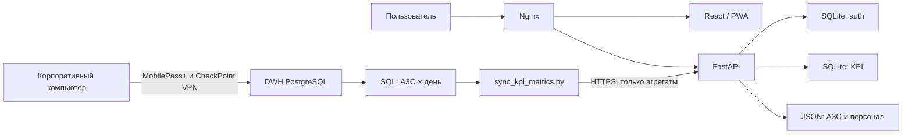
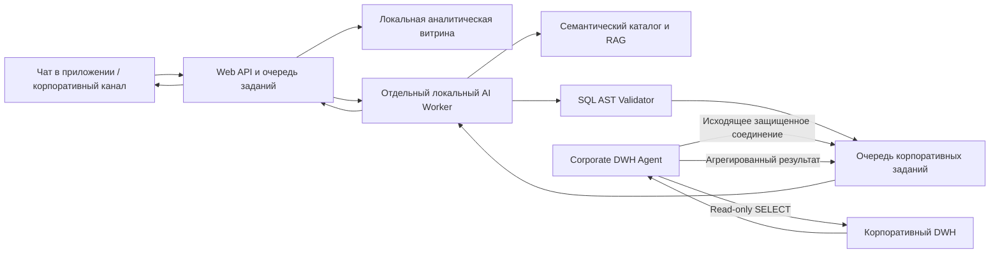

# Техническое задание
## Развитие платформы «Классификатор АЗС» и внедрение локального AI-аналитика

**Версия:** 4.0
**Дата:** 11 июля 2026 года
**Статус:** проект для согласования
**Назначение:** внутреннее использование
**Предыдущая версия:** `ТЗ_Классификатор_АЗС_v3.md`

---

## 1. Общие положения

### 1.1. Наименование системы

Веб-платформа «Классификатор АЗС» для просмотра объектов сети, операционных показателей, аналитики, кадровых рекомендаций и диалогового анализа данных корпоративного DWH.

### 1.2. Цель проекта

Развить существующее приложение до надежной внутренней аналитической платформы, которая:

1. предоставляет актуальный реестр и карту АЗС;
2. показывает фактические KPI по каждой АЗС и выбранному месяцу;
3. сравнивает KPI с предыдущим месяцем и аналогичным периодом прошлого года;
4. корректно показывает отсутствие данных без использования заглушек;
5. получает из DWH только агрегированные показатели и не переносит на сервер сырые транзакционные данные;
6. работает независимо от доступности корпоративного VPN после успешной загрузки агрегатов;
7. принимает аналитические вопросы на естественном языке;
8. безопасно формирует и выполняет read-only SQL-запросы к DWH;
9. объясняет обнаруженные изменения и возвращает ответ пользователю в чат;
10. использует локальную языковую модель без передачи корпоративных данных внешним AI API.

### 1.3. Ожидаемый результат

После выполнения ТЗ пользователь должен иметь возможность выбрать АЗС и месяц, увидеть достоверные показатели и сравнения, а также задать вопрос вида:

> Почему выручка по территории снизилась в июле относительно июня и какие АЗС дали основной отрицательный вклад?

Система должна определить контекст вопроса, построить план анализа, сформировать безопасные SQL-запросы, получить агрегированные результаты, выполнить декомпозицию показателей и вернуть обоснованный ответ с указанием периода, покрытия и актуальности данных.

### 1.4. Масштаб

| Параметр | Значение |
|---|---|
| Пилотная группа | 10–15 пользователей |
| Целевая аудитория | До 1 000 зарегистрированных пользователей |
| Одновременная нагрузка | Требует уточнения; базовый приемочный профиль — 50 активных web-пользователей |
| AI-нагрузка пилота | 1–2 одновременно выполняемых задания, остальные находятся в очереди |

---

## 2. Фактическое состояние на дату ТЗ

### 2.1. Реализованные компоненты

| Компонент | Статус | Комментарий |
|---|---|---|
| Production-сайт | Реализован | React/PWA, Nginx, FastAPI, systemd |
| Корпоративная авторизация | Реализована | Регистрация, вход, подтверждение email, восстановление пароля, сессии |
| Реестр и карта АЗС | Реализованы | Поиск, фильтры, карточки, геоданные, избранное |
| Карточка АЗС | Реализована | Атрибуты объекта, контакты, инфраструктура, качество данных |
| Локальная KPI-витрина | Реализована | SQLite на сервере, дневная гранулярность АЗС × дата |
| Защищенный импорт KPI | Реализован частично | Bearer-токен, пакетная загрузка, upsert; требуется атомарность периода |
| Историческая загрузка | Реализована | Данные с 01.01.2024 по текущую доступную дату |
| Выбор месяца | Реализован | Список месяцев и кнопки предыдущего/следующего месяца |
| MoM и YoY | Реализованы | Для неполного месяца используется одинаковое число дней |
| Отсутствие KPI | Реализовано | Прочерки и сообщение «нет информации» вместо заглушек |
| Кадровые рекомендации | Реализованы частично | Файловый источник; требуется исключить остаточные mock-значения |
| Аналитика и сравнение АЗС | Реализованы частично | Требуется оптимизация запросов и контроль реальных источников |
| AI-аналитик | Не реализован | Требуется отдельный контур |
| RBAC по организационной структуре | Не реализован | Есть корпоративный допуск, но нет строковых ограничений по объектам |
| CI/CD, backup и rollback | Реализованы частично | Есть deploy-скрипт и health-check; нет полного production-контура |

### 2.2. Состояние production-витрины

Контрольный снимок на 11.07.2026:

| Параметр | Значение |
|---|---:|
| Дневных агрегированных строк | 2 139 616 |
| Периодов | 31 месяц |
| Диапазон дат | 01.01.2024–10.07.2026 |
| Уникальных КССС в KPI-витрине | 2 479 |
| Режим API | `local` |
| Состояние auth DB | `ok` |
| Состояние KPI DB | `ok` |

Значения являются контрольным снимком, а не фиксированным пределом системы.

### 2.3. Текущий сервер

| Ресурс | Фактическое значение |
|---|---:|
| CPU | 1 vCPU, AMD EPYC Milan |
| RAM | 957 MiB |
| Swap | отсутствует |
| GPU | отсутствует |
| Диск | 20 GB, свободно около 17 GB |

Текущий сервер пригоден для существующего сайта и небольшой пилотной нагрузки, но непригоден для размещения рабочей локальной LLM. AI-инференс должен выполняться на отдельном узле.

---

## 3. Термины и сокращения

| Термин | Определение |
|---|---|
| АЗС | Автозаправочная станция |
| КССС / `ksss` | Уникальный код АЗС, используемый для связи источников |
| DWH | Корпоративное хранилище данных PostgreSQL |
| KPI | Выручка, объем топлива, количество чеков, средний чек НТУ |
| НТУ | Нетопливные товары и услуги в определенных бизнес-категориях |
| MoM | Сравнение с предыдущим месяцем |
| YoY | Сравнение с аналогичным месяцем прошлого года |
| MTD | Данные с первого числа месяца по последнюю доступную дату |
| AI-аналитик | Локальный агент, планирующий анализ, формирующий SQL и объясняющий результат |
| NL-to-SQL | Преобразование вопроса на естественном языке в SQL |
| Семантический каталог | Версионируемое описание таблиц, связей, метрик и бизнес-правил DWH |
| Corporate DWH Agent | Сервис внутри корпоративного контура, выполняющий разрешенные SQL-задания |
| Import run | Одна логическая попытка загрузки выбранного периода KPI |
| Golden set | Набор проверенных вопросов, SQL и ожидаемых ответов для оценки AI |

---

## 4. Границы проекта

### 4.1. В состав проекта входит

- развитие существующего React/FastAPI-приложения;
- надежная загрузка агрегированных KPI из DWH;
- хранение KPI с 01.01.2024;
- месячная навигация и сравнительная аналитика;
- корректные состояния отсутствия данных;
- кадровые рекомендации без mock-значений;
- мониторинг свежести и качества данных;
- роли и ограничения доступа;
- чат AI-аналитика;
- локальная LLM, локальный RAG и безопасный NL-to-SQL;
- выполнение SQL через read-only корпоративный агент;
- доставка ответа тому пользователю и в тот чат, откуда пришел вопрос;
- журналирование, тестирование, резервное копирование и контролируемый деплой.

### 4.2. В состав проекта не входит

- копирование всей DWH на публичный сервер;
- передача сырых чеков, клиентов, карт и транзакций во внешний контур;
- автоматизация или обход MobilePass+ и CheckPoint Mobile;
- хранение пароля DWH на публичном сервере;
- выполнение AI-моделью `INSERT`, `UPDATE`, `DELETE`, DDL или административных команд;
- использование внешних LLM API без отдельного письменного согласования;
- признание корреляции доказанной бизнес-причиной без подтверждающих данных;
- немедленный переход на микросервисную архитектуру;
- обучение собственной фундаментальной модели с нуля.

---

## 5. Пользователи и роли

### 5.1. Базовые роли

| Роль | Доступ к данным | Дополнительные возможности |
|---|---|---|
| Администратор системы | Все разрешенные данные | Пользователи, роли, импорт, аудит, конфигурация AI |
| Аналитик сети | Все АЗС в разрешенном контуре | Аналитика, сравнение, AI-запросы, просмотр SQL |
| Региональный менеджер | АЗС своего региона | Аналитика и AI только по своему региону |
| Территориальный менеджер | АЗС своей территории | Аналитика и AI только по своей территории |
| Руководитель АЗС | Одна или несколько закрепленных АЗС | Карточки, KPI, рекомендации и вопросы по своим объектам |
| Аудитор / качество | Разрешенные АЗС, только чтение | Реестр, качество данных, отчеты и аудит |

### 5.2. Требования к авторизации и правам

| ID | Требование |
|---|---|
| AUTH-001 | Доступ разрешается только аутентифицированным корпоративным пользователям из разрешенных доменов или allowlist. |
| AUTH-002 | Email должен быть подтвержден одноразовым кодом с ограниченным сроком действия и количеством попыток. |
| AUTH-003 | Сессия хранится в `httpOnly`, `Secure`, `SameSite=Strict` cookie. На сервере хранится только хеш токена. |
| AUTH-004 | Политика корпоративного доступа повторно проверяется при каждой активной сессии. |
| AUTH-005 | Каждому пользователю назначаются роль и область данных: НПО, регион, территория или список КССС. |
| AUTH-006 | Ограничение области применяется на backend и, после миграции в PostgreSQL, дублируется Row-Level Security. |
| AUTH-007 | AI не может получить или вывести данные за пределами области пользователя. |
| AUTH-008 | Должны журналироваться входы, отказы, смена ролей, AI-запросы и административные действия. |
| AUTH-009 | В production запрещены `AUTH_DISABLED` и режим возврата OTP-кода в API. |
| AUTH-010 | На целевом этапе должна быть предусмотрена интеграция с корпоративным SSO/AD/LDAP, если она будет согласована. |

---

## 6. Архитектура системы

### 6.1. Текущая архитектура KPI



### 6.2. Целевая гибридная архитектура



### 6.3. Архитектурные принципы

1. Публичный сервер никогда не устанавливает VPN-соединение и не хранит реквизиты DWH.
2. Стандартные KPI-вопросы по уже загруженным данным выполняются на локальной витрине без обращения к DWH.
3. Новые аналитические вопросы выполняются через Corporate DWH Agent.
4. Corporate DWH Agent инициирует только исходящее соединение к очереди; входящий доступ из интернета в корпоративную сеть не требуется.
5. AI-модель рассматривается как недоверенный генератор предложений. Окончательное разрешение SQL принимает детерминированный валидатор.
6. Для текущего масштаба сохраняется модульный монолит. Выделяются модули внутри одного backend, а не отдельные микросервисы.
7. AI-инференс не размещается на текущем web-VPS.

---

## 7. Функциональные требования к реестру АЗС

| ID | Требование |
|---|---|
| ST-001 | Система должна отображать реестр АЗС и карту с единым набором объектов. |
| ST-002 | Должны поддерживаться поиск по КССС, номеру, названию, адресу и ответственным лицам. |
| ST-003 | Должны поддерживаться фильтры по НПО, субъекту, статусу, типу, локации, сервисам и качеству данных. |
| ST-004 | Пользователь должен иметь возможность открывать карточку АЗС из реестра, карты, аналитики и сравнения. |
| ST-005 | Карточка должна показывать ответственных, контакты, формат, инфраструктуру, сервисы, координаты и замечания качества. |
| ST-006 | Объекты без валидных координат не отображаются на карте, но не должны теряться из общего справочника. |
| ST-007 | Избранные АЗС сохраняются для пользователя. При переходе к серверному профилю данные должны синхронизироваться между устройствами. |
| ST-008 | Исторические отчеты должны использовать атрибуты АЗС, действовавшие в соответствующем периоде, если такие данные доступны. |

---

## 8. KPI и месячная аналитика

### 8.1. Период данных

| ID | Требование |
|---|---|
| KPI-001 | Нижняя граница KPI фиксируется как 01.01.2024. Более ранние данные не загружаются и не отображаются. |
| KPI-002 | Верхняя граница равна последней доступной дате в DWH, но не должна превышать текущую календарную дату. |
| KPI-003 | Список месяцев формируется по реально загруженным периодам, а не по статическому календарю. |
| KPI-004 | По умолчанию выбирается последний доступный месяц. |
| KPI-005 | Пользователь может выбрать месяц через список и кнопки предыдущего/следующего месяца. |
| KPI-006 | Выбранный период применяется к карточке KPI, аналитике, сравнению и похожим АЗС. |

### 8.2. Метрики

| Метрика | Поле API | Единица | Правило расчета |
|---|---|---:|---|
| Выручка | `revenue` | руб. | Сумма `amount_payment` с учетом согласованной семантики возвратов |
| Объем топлива | `fuelVolume` | литры | Сумма объема только топливных товарных позиций; правило требует подтверждения владельцем данных |
| Количество чеков | `checks` | шт. | Уникальные чеки продаж минус уникальные чеки возврата |
| Средний чек НТУ | `avgCheck` | руб. | `SUM(revenue_ntu) / NULLIF(SUM(checks_ntu), 0)` за выбранный период |

Категории НТУ:

- `Продовольственные товары`;
- `Продукция кафе`;
- `Непродовольственные товары`.

### 8.3. Правила расчета

| ID | Требование |
|---|---|
| KPI-010 | Гранулярность источника и локальной витрины: одна строка на КССС и календарную дату. |
| KPI-011 | Идентификатор чека считается структурированным кортежем `(cheque_id, cashregister_id, cheque_number)`, без строковой конкатенации. |
| KPI-012 | Справочник категорий товаров должен быть дедуплицирован до одной строки на `gds_ksss`, чтобы JOIN не умножал выручку. |
| KPI-013 | Средний чек месяца рассчитывается из сумм `revenue_ntu` и `checks_ntu`, а не как среднее дневных средних. |
| KPI-014 | Нулевое фактическое значение отличается от отсутствия строки. Ноль отображается как `0`, отсутствие данных — как прочерк. |
| KPI-015 | Денежные показатели хранятся без предварительного форматирования; форматирование выполняется на клиенте. |
| KPI-016 | Отрицательные значения, связанные с возвратами, не отбрасываются автоматически и проверяются правилами качества данных. |
| KPI-017 | Формулы KPI версионируются. Ответ API и AI-аудит должны содержать версию определения метрик. |
| KPI-018 | Бизнес-дата и границы месяца определяются в часовом поясе `Europe/Moscow`; технические timestamps хранятся в UTC и отображаются пользователю в МСК. |

### 8.4. Сравнения MoM и YoY

| ID | Требование |
|---|---|
| KPI-020 | Для выбранного завершенного месяца MoM рассчитывается относительно полного предыдущего месяца. |
| KPI-021 | Для выбранного завершенного месяца YoY рассчитывается относительно полного аналогичного месяца прошлого года. |
| KPI-022 | Если выбранный месяц загружен не полностью, сравниваются одинаковые дни: например, 1–10 июля с 1–10 июня и 1–10 июля прошлого года. |
| KPI-023 | Последний доступный день определяется по фактически загруженным строкам выбранного набора объектов. |
| KPI-024 | Формула изменения: `(current - baseline) / ABS(baseline) × 100%`. |
| KPI-025 | Если базовый период отсутствует или его значение равно нулю, процент изменения не рассчитывается и отображается прочерк. |
| KPI-026 | Интерфейс должен явно показывать, что сравнение выполнено по сопоставимому числу дней. |

### 8.5. Отсутствие данных

| ID | Требование |
|---|---|
| KPI-030 | Если по АЗС нет ни одной строки за выбранный месяц, все KPI отображаются прочерками с сообщением «Нет информации по этой АЗС за выбранный месяц». |
| KPI-031 | Если отсутствует только одна метрика, прочерк отображается только для нее; остальные фактические показатели сохраняются. |
| KPI-032 | В production запрещено подменять отсутствующие KPI детерминированными или случайными mock-значениями. |
| KPI-033 | API должен возвращать `404` или явный `hasData=false` для отсутствующего набора, а не набор нулевых заглушек. |
| KPI-034 | Источник данных и время последней загрузки отображаются пользователю. |

---

## 9. Кадровые данные и рекомендации

| ID | Требование |
|---|---|
| STAFF-001 | Кадровые данные привязываются к КССС и месяцу. |
| STAFF-002 | Если по выбранному месяцу нет данных, отдельные значения отображаются прочерками. |
| STAFF-003 | Если по АЗС нет кадровых данных ни за один доступный месяц, раздел рекомендаций полностью скрывается. |
| STAFF-004 | В сравнении АЗС и аналитике запрещено использовать `mock_staff_total`. При отсутствии факта возвращается `null`. |
| STAFF-005 | Источник, период и дата актуальности кадровых данных должны отображаться пользователю. |
| STAFF-006 | Подготовка из Excel/JSON сохраняется для пилота, но целевой источник должен иметь формализованный контракт или DWH-витрину. |
| STAFF-007 | Будущая AI-рекомендация по персоналу должна отделяться от фактической численности и содержать метод расчета, период и допущения. |

---

## 10. Аналитика и сравнение

| ID | Требование |
|---|---|
| AN-001 | Аналитика должна группировать показатели по АЗС, территории, региону и другим разрешенным измерениям. |
| AN-002 | Все группировки должны использовать тот же выбранный месяц и правила MTD, MoM и YoY. |
| AN-003 | Пользователь должен сравнивать до пяти АЗС одновременно. |
| AN-004 | Похожие АЗС определяются по формату, локации, региону, сервисам и экономическому профилю. |
| AN-005 | Причины похожести должны быть объяснимыми и отображаться пользователю. |
| AN-006 | Агрегаты для обзора и похожих АЗС должны рассчитываться пакетными SQL-запросами, без запросов по одной станции в цикле. |
| AN-007 | Исторические показатели не должны автоматически относиться к текущему менеджеру, если доступна история организационной структуры. |
| AN-008 | Все выгрузки должны учитывать область доступа пользователя. |

---

## 11. Синхронизация DWH → сервер

### 11.1. Общая схема подключения

1. Пользователь вручную проходит MFA в MobilePass+ и подключает CheckPoint VPN.
2. Локальный sync-скрипт подключается к DWH read-only учетной записью.
3. SQL агрегирует данные до уровня КССС × день.
4. Скрипт нормализует и проверяет записи.
5. Агрегаты отправляются по HTTPS в защищенный import API.
6. Сервер атомарно публикует период в локальной витрине.
7. Новые данные доступны сайту без обновления кода и без перезапуска сервиса.

Обновление кода проекта и обновление данных являются независимыми процессами. Деплой требуется только при изменении приложения, схемы или логики. Обычная загрузка KPI не требует `git pull`, сборки frontend или рестарта FastAPI.

### 11.2. SQL-выгрузка

| ID | Требование |
|---|---|
| ETL-001 | SQL принимает `period_start`, `period_end` и жесткую нижнюю границу `2024-01-01`. |
| ETL-002 | Фильтр периода использует полуинтервал `account_date >= start AND account_date < end`. |
| ETL-003 | Выгружаются только `metric_date`, `ksss`, `revenue`, `revenue_ntu`, `fuel_volume`, `checks`, `checks_ntu`, `avg_check`. |
| ETL-004 | Сырые идентификаторы чеков, товары, клиенты, карты и транзакционные строки не отправляются на сервер. |
| ETL-005 | SQL выполняется отдельной read-only учетной записью с доступом только к разрешенным схемам или представлениям. |
| ETL-006 | Семантика `amount_payment`, возвратов и `volume` должна быть письменно подтверждена владельцем данных. |
| ETL-007 | Запрос должен исключать пустой КССС и предотвращать размножение строк на справочных JOIN. |

### 11.3. Первая и регулярная загрузка

| ID | Требование |
|---|---|
| ETL-010 | Первая загрузка выполняется помесячно с января 2024 года по текущий месяц. |
| ETL-011 | Повторный запуск любого месяца должен быть идемпотентным. |
| ETL-012 | Регулярная загрузка полностью перечитывает текущий месяц, чтобы учитывать исправления DWH, а не только добавляет отсутствующие даты. |
| ETL-013 | В первые семь дней нового месяца дополнительно перечитывается предыдущий месяц для учета поздних проводок. |
| ETL-014 | Для более старых периодов выполняется периодическая сверка количества строк и контрольных сумм. |
| ETL-015 | Пустой результат DWH не должен удалять опубликованный месяц без явного подтверждения или настроенного правила. |
| ETL-016 | Скрипт должен поддерживать `dry-run`, один период, диапазон периодов и безопасное возобновление после ошибки. |
| ETL-017 | `--limit` должен применяться в SQL или серверном cursor, а не после загрузки всего результата в память. |

### 11.4. Атомарный импорт

Текущая схема «удалить период первым пакетом, затем дописывать пакетами» должна быть заменена.

Целевой протокол:

1. `POST /api/internal/kpi/import-runs` создает import run и возвращает `runId`.
2. Клиент передает ожидаемое количество строк, период, версию SQL и checksum набора.
3. Пакеты загружаются в staging-таблицу с `runId`, `chunkNumber` и idempotency key.
4. Повторная отправка пакета не создает дубликаты.
5. `POST /api/internal/kpi/import-runs/{runId}/finalize` проверяет полноту, уникальность, даты и checksum.
6. Только после успешной проверки одна транзакция заменяет опубликованный период.
7. При любой ошибке предыдущая опубликованная версия месяца остается доступной.
8. Незавершенные staging-наборы удаляются по TTL после сохранения аудита.

| ID | Требование |
|---|---|
| ETL-020 | Импорт одного месяца должен быть атомарным независимо от количества HTTP-пакетов. |
| ETL-021 | Каждый запуск имеет статусы `created`, `uploading`, `validating`, `published`, `failed`, `cancelled`. |
| ETL-022 | Сервер хранит количество строк, checksum, время, источник, версию SQL и текст безопасной ошибки. |
| ETL-023 | Клиент автоматически повторяет `429` и временные `5xx` с exponential backoff и jitter. |
| ETL-024 | Клиент учитывает `Retry-After`, если заголовок присутствует. |
| ETL-025 | Запрещено публиковать записи за пределами периода или раньше 01.01.2024. |
| ETL-026 | На `(metric_date, ksss)` действует уникальное ограничение. |

### 11.5. `KPI_IMPORT_TOKEN`

`KPI_IMPORT_TOKEN` является отдельным машинным секретом, который разрешает загрузку агрегатов. Он не является паролем пользователя и не дает доступ к DWH.

| ID | Требование |
|---|---|
| ETL-030 | Токен должен иметь не менее 32 случайных байт энтропии. |
| ETL-031 | На сервере предпочтительно хранить только `KPI_IMPORT_TOKEN_SHA256`. |
| ETL-032 | Исходный токен хранится только в локальном secret store корпоративной машины. |
| ETL-033 | Токен не коммитится в Git, не включается в логи и не возвращается API. |
| ETL-034 | Должна поддерживаться ротация токена без потери KPI. |
| ETL-035 | Rate limit импорта должен быть общим для всех API workers или применяться на Nginx/Redis, а не только в памяти процесса. |

### 11.6. Режимы обновления при MobilePass+

| Режим | Поведение | Ограничение |
|---|---|---|
| Текущий ручной | Оператор подключает VPN и запускает sync | Свежесть зависит от действий оператора |
| Полуавтоматический | Локальный агент обрабатывает очередь, пока VPN уже активен | Не устанавливает VPN и не вводит OTP |
| Целевой корпоративный | Согласованный runner внутри сети выполняет расписание | Требует корпоративного сервиса и разрешения |

Автоматизация MobilePass+, хранение OTP или имитация действий CheckPoint запрещены.

---

## 12. Модель данных приложения

### 12.1. KPI-витрина

Таблица `station_kpi_daily`:

| Поле | Тип | Назначение |
|---|---|---|
| `metric_date` | date | Дата показателей |
| `period` | char(7) | Месяц `YYYY-MM` |
| `ksss` | varchar | Код АЗС |
| `revenue` | numeric | Дневная выручка |
| `revenue_ntu` | numeric, nullable | Дневная выручка НТУ |
| `fuel_volume` | numeric | Дневной объем топлива |
| `checks` | numeric | Дневное количество чеков |
| `checks_ntu` | numeric, nullable | Дневные чеки НТУ |
| `avg_check` | numeric, nullable | Диагностический дневной средний чек |
| `updated_at` | timestamp | Время подготовки записи |
| `source` | varchar | Источник/версия выгрузки |
| `import_run_id` | uuid | Запуск, опубликовавший запись |

Первичный ключ: `(metric_date, ksss)`.

Обязательные индексы:

- `(period)`;
- `(ksss, period)`;
- `(updated_at)`;
- при PostgreSQL — индексы под группировки аналитики и область доступа.

### 12.2. Импорт

Добавляются таблицы:

- `kpi_import_runs` — метаданные и состояние запуска;
- `station_kpi_daily_staging` — непубличные пакеты до finalize;
- `data_quality_events` — нарушения качества и решения по ним.

### 12.3. AI-контур

Добавляются сущности:

| Сущность | Назначение |
|---|---|
| `assistant_questions` | Вопрос, пользователь, чат, область доступа и статус |
| `assistant_runs` | План, модель, версия каталога, длительность и итог |
| `assistant_queries` | SQL, параметры, результат валидации и статистика выполнения |
| `assistant_feedback` | Оценка ответа и комментарий пользователя |
| `assistant_jobs` | Очередь заданий для Corporate DWH Agent |
| `approved_queries` | Проверенные шаблоны типовых вопросов |
| `semantic_catalog_versions` | Версии каталога DWH и определений KPI |

Сырые результаты DWH не должны сохраняться бессрочно. Для агрегированных промежуточных результатов задается TTL и шифрование в соответствии с требованиями ИБ.

---

## 13. Мониторинг свежести и качества данных

| ID | Требование |
|---|---|
| DQ-001 | API должен возвращать последнюю загруженную дату, время публикации, число периодов и статус последнего import run. |
| DQ-002 | UI показывает «Данные по … включительно» и время последнего обновления. |
| DQ-003 | Если данные старше заданного SLA, показывается предупреждение, но старые проверенные данные остаются доступны. |
| DQ-004 | Контролируются дубликаты `(metric_date, ksss)`, пустые КССС, даты вне диапазона, NaN/Infinity и неожиданные скачки строк. |
| DQ-005 | Контролируется число дней по месяцу и доля АЗС с данными. |
| DQ-006 | Для завершенных месяцев выполняется сверка checksum и количества строк с DWH. |
| DQ-007 | Health-check считается `degraded`, если недоступна auth DB или KPI DB, либо последний опубликованный импорт поврежден. |
| DQ-008 | Должна быть административная страница истории импортов и ошибок качества. |

Целевой SLA зависит от режима:

- ручной пилот: не реже одного успешного обновления в рабочий день после актуализации DWH;
- корпоративный runner: расписание определяется частотой обновления DWH, целевой лаг — не более двух часов;
- ожидание VPN не учитывается как время выполнения AI-задания, но явно показывается пользователю.

---

## 14. AI-аналитик

### 14.1. Назначение

AI-аналитик должен принимать вопросы на русском языке, понимать терминологию сети АЗС, находить подходящие данные, строить безопасный план исследования и возвращать проверяемый ответ.

Поддерживаемые классы вопросов:

1. фактические значения и рейтинги;
2. сравнение периодов и объектов;
3. поиск основного вклада в изменение показателя;
4. декомпозиция по АЗС, территории, региону, дню, категории и другим разрешенным измерениям;
5. обнаружение аномалий и пропусков данных;
6. поиск похожих объектов;
7. объяснение состава метрики и используемых правил;
8. подготовка агрегированного ответа и таблицы для выгрузки.

### 14.2. Ограничения AI

| ID | Требование |
|---|---|
| AI-001 | AI не должен выполнять SQL напрямую под своей учетной записью. |
| AI-002 | AI не должен иметь пароль DWH или возможность изменять данные. |
| AI-003 | При неоднозначности периода, метрики или области AI должен запросить уточнение. |
| AI-004 | AI не должен называть корреляцию доказанной причиной. Формулировка должна отражать фактический вклад и ограничения данных. |
| AI-005 | При отсутствии подтверждающих данных AI должен сообщить, какие источники нужны для ответа. |
| AI-006 | Ответ должен быть основан только на фактически выполненных запросах и утвержденных определениях метрик. |
| AI-007 | Внешние AI API запрещены по умолчанию. Их включение требует отдельного решения и изменения настоящего ТЗ. |
| AI-008 | Относительные периоды «сегодня», «вчера», «текущий месяц» и «прошлый месяц» разрешаются в `Europe/Moscow` и явно указываются в ответе абсолютными датами. |
| AI-009 | Пользователю показывается структурированный план анализа и доказательства, но не внутренний chain-of-thought модели. Внутренний chain-of-thought не сохраняется в журнале. |

### 14.3. Семантический каталог DWH

Первый этап «обучения» AI выполняется без fine-tuning. Создается версионируемый каталог YAML/JSON.

Для каждой таблицы или представления каталог содержит:

- полное имя и бизнес-описание;
- гранулярность одной строки;
- ключи и допустимые JOIN;
- период доступных данных и частоту обновления;
- описание колонок и единиц измерения;
- чувствительность и разрешенные роли;
- допустимые значения справочников;
- правила возвратов, NULL и временных зон;
- синонимы на русском языке;
- утвержденные метрики и формулы;
- примеры корректных вопросов и параметризованного SQL;
- запрещенные или устаревшие поля.

| ID | Требование |
|---|---|
| AI-010 | Каталог хранится в Git без секретов и проходит review владельца данных. |
| AI-011 | Каждая версия каталога имеет номер, дату и автора согласования. |
| AI-012 | Выполненный AI-запрос сохраняет версию каталога и определения метрик. |
| AI-013 | В prompt передается только релевантный фрагмент каталога, найденный локальным retrieval. |
| AI-014 | Для русскоязычного retrieval допускается локальная embedding-модель BGE-M3 или модель, прошедшая внутренний benchmark. |

### 14.4. Состояния AI-задания

```text
received
  -> clarification_required
  -> planning
  -> validating
  -> awaiting_vpn
  -> executing
  -> analyzing
  -> completed

Из любого рабочего состояния: failed / cancelled
```

Пользователь должен видеть текущий статус и не обязан держать страницу открытой.

### 14.5. План диагностического анализа

Для вопроса «Почему изменилась выручка?» агент должен уметь выполнить последовательность:

1. определить объект, период и базу сравнения;
2. проверить полноту и сопоставимость дней;
3. воспроизвести изменение общей выручки;
4. разложить изменение на чеки и средний чек;
5. разложить вклад по АЗС и организационным уровням;
6. при наличии данных разделить топливо и НТУ;
7. проверить концентрацию изменения по дням;
8. проверить качество и пропуски данных;
9. ранжировать факторы по абсолютному вкладу;
10. сформировать вывод, не превышающий доказательность данных.

### 14.6. Формат ответа

Ответ пользователю должен содержать:

1. краткий вывод в 1–3 предложениях;
2. числовое изменение и базу сравнения;
3. основные факторы с величиной вклада;
4. объекты или разрезы с наибольшим влиянием;
5. покрытие данных и последнюю доступную дату;
6. ограничения и уровень уверенности;
7. ссылку на таблицу/выгрузку, если она сформирована;
8. SQL и технический план — только для ролей, которым это разрешено.

Пример допустимой формулировки:

> За 1–10 июля выручка снизилась на 8,2% к 1–10 июня. Около 64% снижения пришлось на 12 АЗС; основной измеримый вклад связан с уменьшением количества чеков. Эти данные показывают вклад факторов, но не доказывают операционную причину без сведений о простоях, ценах и доступности топлива.

### 14.7. SQL Validator

SQL, созданный моделью, не может выполняться без детерминированной проверки.

| ID | Требование |
|---|---|
| AI-SQL-001 | SQL разбирается PostgreSQL-совместимым AST-парсером, например `sqlglot`; regex и `sqlparse` недостаточны как единственная защита. |
| AI-SQL-002 | Разрешается ровно один statement типа `SELECT` или `WITH … SELECT`. |
| AI-SQL-003 | Запрещаются DDL, DML, `COPY`, `CALL`, `DO`, изменение сессии и функции с побочными эффектами. |
| AI-SQL-004 | Проверяются все CTE и вложенные запросы. |
| AI-SQL-005 | Таблицы, представления, функции и колонки ограничиваются allowlist семантического каталога. |
| AI-SQL-006 | `SELECT *` запрещается для DWH-запросов. |
| AI-SQL-007 | Выполнение происходит в read-only transaction с `statement_timeout`. |
| AI-SQL-008 | До выполнения применяется `EXPLAIN` и лимит допустимой стоимости/сканируемого объема. |
| AI-SQL-009 | Результат ограничивается максимальным числом строк и размером ответа. |
| AI-SQL-010 | Параметры дат, КССС и фильтров передаются драйверу отдельно от SQL. |
| AI-SQL-011 | Область доступа пользователя добавляется сервером и не может быть отменена моделью. |
| AI-SQL-012 | Запросы к персональным или запрещенным данным блокируются до исполнения. |
| AI-SQL-013 | В журнал сохраняются hash вопроса, SQL, параметры, решение валидатора, длительность, число строк и пользователь. Секреты и OTP не журналируются. |

### 14.8. Агрегация вопросов

| ID | Требование |
|---|---|
| AI-Q-001 | Каждый вопрос связывается с `userId`, `chatId`, каналом и correlation ID. |
| AI-Q-002 | Семантически похожие вопросы классифицируются и могут использовать утвержденный шаблон. |
| AI-Q-003 | Повторный вопрос с теми же параметрами может получать кешированный ответ при совпадении версии данных и каталога. |
| AI-Q-004 | Администратор видит статистику тем, долю успешных запросов, ошибки и оценки пользователей. |
| AI-Q-005 | Проверенные пары «вопрос → SQL → ответ» пополняют approved query library и golden set. |
| AI-Q-006 | Персональная история диалога недоступна другим пользователям, кроме уполномоченного аудита. |

### 14.9. Чат и доставка ответа

Первый канал — чат внутри существующего приложения. Архитектура должна допускать адаптеры для корпоративных мессенджеров после согласования.

| ID | Требование |
|---|---|
| CHAT-001 | Пользователь отправляет вопрос и сразу получает идентификатор задания. |
| CHAT-002 | Статус обновляется через SSE, WebSocket или безопасный polling. |
| CHAT-003 | После завершения ответ отправляется в исходный `chatId` и сохраняется в истории пользователя. |
| CHAT-004 | При ожидании VPN отображается состояние «Ожидает корпоративного подключения», а не общая ошибка. |
| CHAT-005 | Пользователь может отменить еще не выполняющееся задание. |
| CHAT-006 | Доступны оценки «верно / неверно» и текстовый комментарий. |
| CHAT-007 | Экспорт ответа не должен обходить права пользователя. |

---

## 15. Локальная языковая модель

### 15.1. Общие требования

| ID | Требование |
|---|---|
| LLM-001 | Инференс выполняется на инфраструктуре под контролем организации. |
| LLM-002 | Во время инференса запросы не отправляются разработчику модели или внешнему провайдеру. |
| LLM-003 | AI API доступен только приложению по localhost или закрытой сети и не публикуется в интернет. |
| LLM-004 | После загрузки артефактов должен поддерживаться offline-режим и запрет исходящего трафика. |
| LLM-005 | Prompt и результаты не пишутся в системные логи по умолчанию. |
| LLM-006 | Модель выбирается по внутреннему benchmark на DWH, а не только по публичному рейтингу. |

### 15.2. Кандидаты

| Этап | Модель-кандидат | Назначение | Минимальный практический узел |
|---|---|---|---|
| Пилот | Qwen2.5-Coder-7B-Instruct Q4_K_M | SQL и проверка архитектуры | 8 CPU, 16 GB RAM; низкая скорость |
| Сбалансированный вариант | gpt-oss-20b MXFP4 | Рассуждение, tool calling, Structured Outputs | 16–24 GB памяти, предпочтительно GPU |
| Целевой кандидат | Qwen3-Coder-30B-A3B-Instruct Q4 | SQL, tool calling, агентный анализ | GPU 24–48 GB, RAM 64 GB |

Окончательный выбор выполняется после сравнения не менее чем на 100 проверенных вопросах. Допускается замена кандидатов на более подходящую локальную модель при сохранении требований безопасности и приемочных метрик.

### 15.3. Рекомендуемая инфраструктура AI Worker

| Ресурс | Рекомендуемое значение |
|---|---:|
| CPU | 8–16 ядер |
| RAM | 64 GB |
| GPU | NVIDIA L4, A10, RTX 3090/4090 или аналог, 24 GB+ VRAM |
| Диск | SSD 100 GB+ |
| ОС | Поддерживаемый Linux LTS |
| Runtime | `llama.cpp` для простого закрытого сервиса; `vLLM` для GPU и конкурентной нагрузки |

AI Worker должен быть отдельным от текущего web-VPS. Наиболее защищенное размещение — внутри корпоративного контура рядом с Corporate DWH Agent. Размещение на отдельном внешнем сервере допускается только для обезличенной схемы и агрегатов после согласования.

### 15.4. Fine-tuning

Fine-tuning не является требованием первого этапа. Приоритет:

1. корректный семантический каталог;
2. retrieval релевантной схемы;
3. проверенные few-shot примеры;
4. детерминированный SQL Validator;
5. golden set и обратная связь.

LoRA/fine-tuning рассматривается после накопления не менее 500 проверенных пар и отдельной оценки риска переобучения и утечки чувствительных примеров.

---

## 16. API

### 16.1. Существующие пользовательские endpoints

| Метод и путь | Назначение |
|---|---|
| `GET /api/health` | Состояние приложения и витрин |
| `GET /api/auth/me` | Текущая сессия |
| `GET /api/auth/policy` | Политика корпоративного доступа |
| `POST /api/auth/register` | Регистрация |
| `POST /api/auth/login` | Вход |
| `POST /api/auth/verify-email` | Подтверждение email |
| `POST /api/auth/request-password-reset` | Запрос восстановления |
| `POST /api/auth/reset-password` | Сброс пароля |
| `POST /api/auth/logout` | Завершение сессии |
| `GET /api/stations` | Реестр АЗС |
| `GET /api/kpis/periods` | Доступные месяцы KPI |
| `GET /api/stations/{ksss}/kpis` | KPI АЗС за месяц |
| `GET /api/stations/{ksss}/staff` | Кадровые данные |
| `GET /api/analytics/overview` | Групповая аналитика |
| `GET /api/stations/{ksss}/similar` | Похожие АЗС |
| `GET /api/analytics/compare` | Сравнение АЗС |

### 16.2. Требуемые endpoints данных

| Метод и путь | Назначение |
|---|---|
| `GET /api/data-health` | Свежесть, покрытие и последний import run |
| `POST /api/internal/kpi/import-runs` | Начало атомарного импорта |
| `PUT /api/internal/kpi/import-runs/{runId}/chunks/{number}` | Идемпотентная загрузка пакета |
| `POST /api/internal/kpi/import-runs/{runId}/finalize` | Проверка и публикация периода |
| `POST /api/internal/kpi/import-runs/{runId}/cancel` | Отмена незавершенного запуска |
| `GET /api/admin/import-runs` | История импортов для администратора |

### 16.3. Требуемые endpoints AI

| Метод и путь | Назначение |
|---|---|
| `POST /api/assistant/questions` | Создать вопрос |
| `GET /api/assistant/questions/{id}` | Получить статус и ответ |
| `GET /api/assistant/questions/{id}/events` | Поток статусов SSE |
| `POST /api/assistant/questions/{id}/cancel` | Отменить вопрос |
| `POST /api/assistant/questions/{id}/feedback` | Оценить ответ |
| `POST /api/internal/assistant/worker/poll` | Получить разрешенное корпоративное задание |
| `POST /api/internal/assistant/jobs/{id}/result` | Вернуть агрегированный результат |
| `POST /api/internal/assistant/jobs/{id}/fail` | Вернуть безопасное описание ошибки |

Все internal endpoints используют отдельные машинные токены, ротацию, rate limit, аудит и защиту от replay.

---

## 17. Нефункциональные требования

### 17.1. Производительность

| ID | Требование |
|---|---|
| NFR-P-001 | P95 обычного API без AI — не более 2 секунд при согласованной пилотной нагрузке. |
| NFR-P-002 | P95 получения KPI одной АЗС — не более 1 секунды. |
| NFR-P-003 | P95 групповой аналитики — не более 3 секунд. |
| NFR-P-004 | Импорт в staging и finalize не должны блокировать чтение опубликованных KPI. |
| NFR-P-005 | Создание AI-задания и возврат идентификатора — не более 1 секунды. |
| NFR-P-006 | Простой AI-вопрос после начала выполнения Corporate DWH Agent — целевой ответ до 60 секунд; сложный диагностический — до 180 секунд. |
| NFR-P-007 | Время ожидания ручного VPN показывается отдельно и не включается в вычислительный SLA. |
| NFR-P-008 | Перед расширенным пилотом проводится нагрузочный тест на 50 активных web-пользователей и 2 параллельных AI-задания без нарушения SLA обычного API. |

### 17.2. Надежность

| ID | Требование |
|---|---|
| NFR-R-001 | Ошибка нового импорта не повреждает последнюю опубликованную версию данных. |
| NFR-R-002 | Для SQLite включаются WAL и `busy_timeout`; число API workers согласуется с моделью конкурентной записи. |
| NFR-R-003 | Выполняется ежедневный online-backup auth DB и KPI DB. |
| NFR-R-004 | Резервные копии шифруются и хранятся отдельно от основного VPS не менее 30 дней. |
| NFR-R-005 | Не реже одного раза в квартал выполняется тестовое восстановление. |
| NFR-R-006 | Для каждого релиза доступен rollback к предыдущей рабочей версии без отката данных пользователя. |

### 17.3. Безопасность

| ID | Требование |
|---|---|
| NFR-S-001 | Все внешние соединения используют TLS. |
| NFR-S-002 | Реальные секреты хранятся только в secret store или `.env`, исключенном из Git. |
| NFR-S-003 | Ранее использованные пилотные реквизиты DWH должны быть ротированы; создается отдельная read-only учетная запись. |
| NFR-S-004 | Machine tokens и пользовательские сессии имеют разные области и не взаимозаменяемы. |
| NFR-S-005 | На AI Worker блокируется исходящий интернет после получения проверенных артефактов модели. |
| NFR-S-006 | В логи не попадают пароли, токены, OTP, полные prompt с чувствительными данными и сырые результаты DWH. |
| NFR-S-007 | Проводятся dependency scan, проверка контейнеров и review прав доступа. |
| NFR-S-008 | История вопросов и выгрузки шифруются и удаляются по утвержденной политике хранения. |

### 17.4. Поддерживаемость

Backend должен быть разделен как минимум на:

```text
backend/app/
  api/routers/
  core/
  schemas/
  services/
  repositories/
  db/migrations/
  integrations/dwh/
  assistant/
```

Frontend должен быть разделен как минимум на:

```text
src/
  app/
  features/auth/
  features/stations/
  features/kpi/
  features/analytics/
  features/staff/
  features/assistant/
  shared/api/
  shared/ui/
```

| ID | Требование |
|---|---|
| NFR-M-001 | Новая функциональность не добавляется в существующие монолитные `main.py` и `main.jsx` без выделения модуля. |
| NFR-M-002 | Изменения схемы выполняются версионированными миграциями. |
| NFR-M-003 | Контракт frontend/backend формируется из OpenAPI или проверяется контрактными тестами. |
| NFR-M-004 | Mock-режим доступен только в development/test и технически запрещен в production. |

### 17.5. Интерфейс и доступность

| ID | Требование |
|---|---|
| NFR-UX-001 | Интерфейс работает на мобильных и desktop-экранах без перекрытия элементов. |
| NFR-UX-002 | Все интерактивные элементы доступны с клавиатуры и имеют видимый focus state. |
| NFR-UX-003 | Для loading, empty, error, stale и partial-data предусмотрены отдельные состояния. |
| NFR-UX-004 | Цвет не является единственным способом передачи роста, падения или ошибки. |
| NFR-UX-005 | AI-ответ должен быть читаемым без просмотра SQL. |

---

## 18. Deployment и эксплуатация

| ID | Требование |
|---|---|
| OPS-001 | Код и данные развертываются независимо. KPI-import не требует deploy. |
| OPS-002 | Релиз загружается во временный release-каталог и активируется атомарным переключением. |
| OPS-003 | Деплой выполняется отдельным пользователем с минимальными правами, а не постоянным `root`. |
| OPS-004 | Проверка SSH host key обязательна; `StrictHostKeyChecking=no` удаляется. |
| OPS-005 | После релиза проверяются frontend, auth API, KPI DB и data freshness. |
| OPS-006 | При неуспешном health-check выполняется автоматический rollback. |
| OPS-007 | CI запускает frontend build, unit/integration tests, E2E smoke и security checks. |
| OPS-008 | Логи ротируются; заполнение диска контролируется. |
| OPS-009 | AI Worker и web-приложение имеют отдельные ресурсы и lifecycle. |

### 18.1. Критерии перехода SQLite → PostgreSQL

SQLite не считается дефектом на текущем масштабе. Миграция выполняется при наступлении одного или нескольких условий:

- несколько экземпляров FastAPI;
- более 50 одновременно активных пользователей в устойчивом режиме;
- регулярная конкурентная запись импорта, AI и пользовательских данных;
- необходимость полноценного RLS;
- требования HA или репликации;
- сложная аналитика перестает укладываться в SLA;
- объем и срок backup/restore становятся неприемлемыми.

После принятия решения используются PostgreSQL, Alembic и пул соединений. Redis добавляется только при появлении измеримой потребности в общей очереди, rate limit или кеше.

---

## 19. Тестирование

### 19.1. Обязательные группы тестов

1. Unit-тесты формул периодов, KPI, MoM, YoY и MTD.
2. Unit-тесты нормализации DWH-строк и валидации импорта.
3. Integration-тест атомарного импорта с ошибкой на среднем пакете.
4. Integration-тесты auth, прав и областей данных.
5. Контрактные тесты API.
6. E2E-тесты выбора месяца, отсутствия KPI и рекомендаций.
7. SQL golden tests для утвержденной DWH-выгрузки.
8. AI golden set: вопрос, ожидаемый план, SQL, результат и ответ.
9. Security-тесты prompt injection, DDL/DML в CTE, обхода allowlist и доступа к чужим объектам.
10. Нагрузочные тесты обычного API и очереди AI.
11. Тест backup/restore.
12. Проверка production-конфигурации на отсутствие mock/dev-режимов.

### 19.2. Приемочные сценарии

| № | Сценарий | Ожидаемый результат |
|---:|---|---|
| 1 | Пользователь выбирает июль 2026 при данных по 10 июля | KPI считаются за 1–10 июля; MoM и YoY используют 1–10 число базовых месяцев |
| 2 | У АЗС нет строк за выбранный месяц | Все KPI — прочерки, отображается «нет информации», mock отсутствует |
| 3 | Есть выручка, но нет корректной базы для YoY | Выручка показана, YoY — прочерк |
| 4 | У АЗС нет кадровых данных ни за один месяц | Раздел рекомендаций не отображается |
| 5 | Кадровые данные отсутствуют только в выбранном месяце | Поля показывают прочерки, синтетические значения не создаются |
| 6 | Второй пакет импорта завершается ошибкой | Опубликованный месяц остается полностью прежним |
| 7 | Пакет повторно отправлен с тем же idempotency key | Дубликаты не создаются |
| 8 | Токен импорта неверен | Запрос отклоняется и журналируется без раскрытия секрета |
| 9 | Пользователь спрашивает AI без указания периода | AI запрашивает уточнение или применяет явно отображенное согласованное правило |
| 10 | AI генерирует `WITH x AS (DELETE …)` | Валидатор блокирует запрос до DWH |
| 11 | Региональный менеджер просит данные чужого региона | Запрос блокируется независимо от сгенерированного SQL |
| 12 | VPN выключен | Задание получает статус `awaiting_vpn`, сайт продолжает работать |
| 13 | AI отвечает на «почему» | Ответ содержит числа, вклад факторов, покрытие и ограничение причинности |
| 14 | KPI DB недоступна | `/api/health` возвращает `degraded`, мониторинг создает событие |
| 15 | Выполнено восстановление backup | Пользователи, периоды и контрольные суммы совпадают с резервной копией |

### 19.3. Критерии качества AI

Модель допускается в пилот после benchmark не менее чем на 100 вопросах.

| Метрика | Порог пилота |
|---|---:|
| Запрещенные SQL, прошедшие validator | 0% |
| Синтаксически исполнимый SQL | не менее 95% |
| Семантически корректный SQL для утвержденных intent | не менее 85% |
| Ответы, подтвержденные результатом SQL | не менее 90% |
| Критические вымышленные факты | не более 2% |
| Корректный запрос уточнения при неоднозначности | не менее 90% сценариев |

На первом этапе каждый новый тип SQL подтверждается аналитиком. Автоматическое выполнение допускается только для классов запросов, прошедших приемку.

---

## 20. Этапы реализации

### Этап A. Стабилизация текущей платформы — 1–2 недели

- ротация ранее использованных DWH-реквизитов;
- отдельная read-only учетная запись;
- атомарный KPI import run;
- retries/backoff и idempotency;
- WAL, `busy_timeout`, согласование числа workers;
- backup и проверка восстановления;
- исправление health-check;
- удаление mock-данных из production-путей;
- тесты KPI и импорта.

**Результат:** ошибки загрузки не повреждают опубликованные данные.

### Этап B. Семантический каталог и качество DWH — 2–4 недели

- описание фактических таблиц, ключей и JOIN;
- подтверждение формул KPI;
- проверка топливного объема и возвратов;
- история организационных атрибутов;
- versioned metric definitions;
- data-health и административный журнал;
- golden SQL для стандартных вопросов.

**Результат:** DWH имеет достаточно формальное описание для безопасной аналитики и AI.

### Этап C. Модульность, RBAC и эксплуатация — 3–5 недель

- разбиение backend и frontend на модули;
- роли и области данных;
- миграции схемы;
- оптимизация batch-аналитики;
- CI/CD, release deployment и rollback;
- мониторинг и алерты.

**Результат:** платформа готова к расширенному пилоту и контролю доступа.

### Этап D. AI-пилот — 4–6 недель

- отдельный AI Worker;
- локальная модель пилота;
- semantic retrieval;
- чат и очередь;
- SQL AST Validator;
- Corporate DWH Agent в ручном VPN-режиме;
- 100+ golden questions;
- обязательное подтверждение новых SQL-классов аналитиком.

**Результат:** ограниченный круг пользователей получает проверяемые ответы на утвержденные типы вопросов.

### Этап E. Production AI и корпоративная автоматизация — 4–8 недель

- выбор production-модели по benchmark;
- корпоративный постоянно доступный runner;
- расширение диагностических цепочек;
- кеширование и approved query library;
- дополнительные чат-адаптеры;
- эксплуатационные SLA и масштабирование.

**Результат:** контролируемый AI-аналитик отвечает без ручного участия для утвержденных сценариев.

Сроки являются ориентировочными для одного full-stack разработчика и уточняются после закрытия открытых вопросов.

---

## 21. Результаты и артефакты проекта

По завершении должны быть переданы:

1. исходный код frontend, backend, sync и Corporate DWH Agent;
2. миграции схемы и инструкции развертывания;
3. параметризованный SQL экспорта KPI;
4. семантический каталог DWH;
5. словарь KPI и история версий формул;
6. спецификация API/OpenAPI;
7. конфигурация локальной модели без весов в Git;
8. SQL Validator и набор политик;
9. golden set и отчет benchmark моделей;
10. автоматизированные тесты;
11. runbook импорта, backup, restore, rollback и инцидентов;
12. руководство администратора и пользователя;
13. журнал согласованных рисков и ограничений.

---

## 22. Риски

| Риск | Уровень | Меры |
|---|---|---|
| Формулы DWH интерпретированы неверно | Высокий | Письменная валидация владельца данных и golden SQL |
| `fuel_volume` включает нетопливные количества | Высокий | Явный фильтр топливной категории и сверка с эталоном |
| Период остается частично загруженным | Высокий | Staging, checksum и атомарный finalize |
| MobilePass+ не позволяет постоянный доступ | Высокий | Ручной/полуавтоматический режим и целевой корпоративный runner |
| Локальная модель строит неверный SQL | Высокий | RAG, AST validator, read-only, benchmark и human approval |
| Публичный VPS скомпрометирован | Высокий | Минимум данных, no DWH secrets, hardening, backup и мониторинг |
| Нет GPU-инфраструктуры | Средний | CPU-пилот 7B или отложенный AI-этап, отдельное бюджетирование |
| AI приписывает корреляции причинность | Средний | Формат ответа, проверка оснований и evaluator |
| Исторические KPI привязаны к текущим менеджерам | Средний | Slowly changing dimensions / исторические справочники |
| SQLite перестает соответствовать нагрузке | Средний | Измеримые критерии перехода на PostgreSQL |
| Чувствительные вопросы сохраняются в логах | Высокий | Редакция, шифрование, TTL и запрет prompt logging |

---

## 23. Открытые вопросы для согласования

1. Кто является владельцем определений выручки, чеков, НТУ и топливного объема?
2. Как в `pet_retail.volume` отделяются литры топлива от количества нетопливных товаров?
3. Как учитываются возвраты в `amount_payment` и `volume`?
4. Есть ли исторический справочник соответствия АЗС, территорий и менеджеров?
5. Какова фактическая частота обновления нужных таблиц DWH?
6. Какой SLA свежести нужен в ручном режиме до появления корпоративного runner?
7. Разрешен ли отдельный AI Worker внутри корпоративной сети?
8. Какой бюджет и тип GPU доступны для пилота и production?
9. Какая корпоративная система идентификации доступна: AD, LDAP, OIDC или SAML?
10. Какие роли и области данных должны быть утверждены владельцем бизнеса?
11. Какой корпоративный чат является целевым после встроенного чата?
12. Каков срок хранения вопросов, SQL, ответов и агрегированных результатов?
13. Разрешено ли показывать сгенерированный SQL обычным пользователям?
14. Какие таблицы и поля DWH запрещены для AI независимо от роли?
15. Кто подтверждает новые классы AI-запросов перед автоматическим выполнением?
16. Каковы ожидаемое число одновременно активных пользователей и пиковый профиль нагрузки?

---

## 24. Критерии завершения проекта

Проект считается выполненным в согласованном объеме, если:

1. все обязательные требования соответствующего этапа реализованы;
2. приемочные сценарии пройдены;
3. production не содержит mock-данных;
4. KPI загружаются атомарно и восстанавливаются из backup;
5. права пользователя применяются ко всем API и AI-запросам;
6. AI не имеет прямых DWH-реквизитов и не может выполнить write-операцию;
7. выбранная локальная модель прошла внутренний benchmark;
8. ответы AI содержат подтверждающие факты, актуальность и ограничения;
9. эксплуатационная документация передана;
10. открытые риски формально приняты ответственными лицами.

---

## 25. Справочные материалы

- `backend/sql/dwh_kpi_daily_export.sql` — текущая агрегирующая SQL-выгрузка;
- `scripts/sync_kpi_metrics.py` — текущий sync-клиент;
- `backend/main.py` — текущий API и локальная витрина;
- `deploy/README.md` — эксплуатация и ручная загрузка KPI;
- [Qwen2.5-Coder-7B-Instruct](https://huggingface.co/Qwen/Qwen2.5-Coder-7B-Instruct);
- [Qwen3-Coder-30B-A3B-Instruct](https://huggingface.co/Qwen/Qwen3-Coder-30B-A3B-Instruct);
- [OpenAI gpt-oss-20b](https://huggingface.co/openai/gpt-oss-20b);
- [BGE-M3](https://huggingface.co/BAAI/bge-m3);
- [llama.cpp](https://github.com/ggml-org/llama.cpp).

---

## Приложение A. Матрица трассировки исходных требований

| Исходное требование | Разделы ТЗ |
|---|---|
| Актуальные KPI из DWH без передачи всей базы | 8, 11, 12 |
| Работа сайта без постоянного VPN | 6, 11.1, 11.6 |
| Ручной MobilePass+ / CheckPoint | 4.2, 11.1, 11.6 |
| Назначение и защита `KPI_IMPORT_TOKEN` | 11.5 |
| Данные с 1 января 2024 года | 8.1, 11.2, 11.3 |
| Следующие загрузки дополняют и исправляют текущий массив | 11.3, 11.4 |
| Выбор июня, июля и других месяцев | 8.1 |
| Сравнение с предыдущим месяцем и прошлым годом | 8.4 |
| Неполный текущий месяц сравнивается по одинаковым дням | 8.4, 19.2 |
| При отсутствии KPI показываются прочерки | 8.5 |
| При отсутствии рекомендаций используются прочерки или скрывается раздел | 9 |
| Обновление данных не требует deploy проекта | 11.1, 18 |
| AI принимает вопросы, пишет SQL и объясняет результат | 14.1–14.6 |
| Ответ возвращается тому, кто задал вопрос | 14.8, 14.9, 16.3 |
| SQL выполняется безопасно и только на чтение | 14.7 |
| Вопросы агрегируются и переиспользуют проверенные запросы | 14.8 |
| Используется локальная модель без внешней передачи данных | 15 |
| Текущий VPS не используется для LLM | 2.3, 6.3, 15.3 |
| Архитектура DWH передается модели через каталог/RAG | 14.3, 15.4 |

---

*ТЗ v4.0 — «Классификатор АЗС» и локальный AI-аналитик — 11 июля 2026 года*
*Для внутреннего использования*
